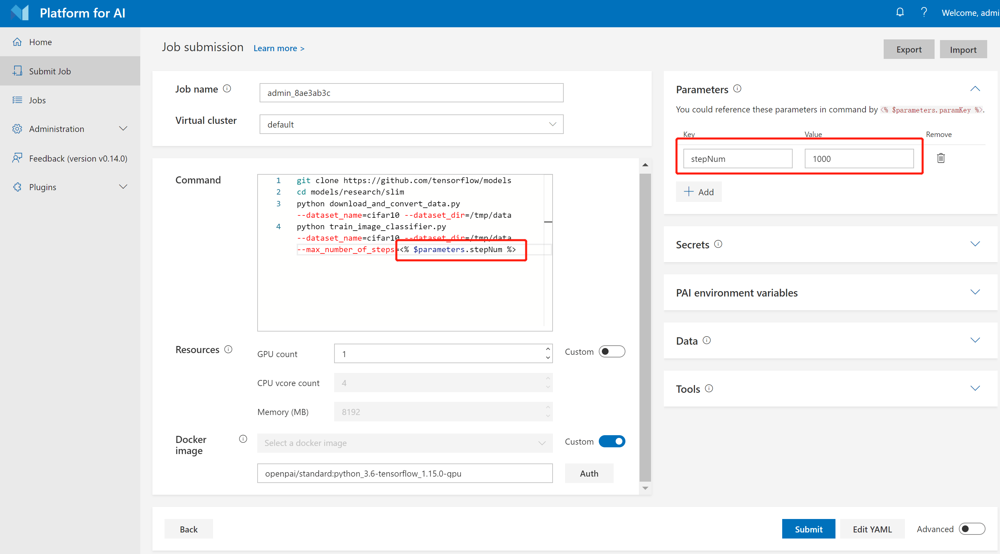

# How to Use Advanced Job Settings

This section covers the following topics:

- Parameters and Secrets
- Distributed Settings and Examples
- Job Exit Specifications, Retry Policies, and Completion Policies

## Parameters and Secrets

### Parameters
It is common to train models with different parameters. We support parameter definition and reference, which provide a flexible way of training and comparing models. You can define your parameters in the Parameters section and reference them by using `<% $parameters.paramKey %>` in commands.



### Secrets

In some cases, it may be necessary to define secret information such as passwords, tokens, etc. You can use the Secrets section for the definition and reference these secrets in commands by `<% $secrets.secretKey %>`. The usage is the same as parameters except that secrets will not be displayed or recorded.

## Distributed Settings

### How to Enable InfiniBand Between Nodes

To enable the InfiniBand between nodes, add `infiniband: true` under extraContainerOptions in the config.
```
...
taskRoles:
  $taskRole:
    extraContainerOptions:
      infiniband: true
    ...
...
```

### How to Ensure Different Nodes Can Be SSH Connected and Time Sync

#### Job SSH
To ensure SSH connectivity across all nodes in the job, add the following SSH plugin to the configuration file:
```
...
extras:
  com.microsoft.pai.runtimeplugin:
    - plugin: ssh
      parameters:
        jobssh: true
        sshbarrier: true
```

#### SSH Barrier
If you want to synchronize all nodes during job running, such as initializing the distributed torch launch after all nodes finish downloading data, add the following command inside the `commands` section of the task role with a timeout in seconds.
```
taskRoles:
  taskrole:
    ...
    commands:
        - echo 'Downloading Data'
        - bash /usr/local/pai/runtime.d/barrier --timeout=500
        - echo 'Start Training'
        - ...
```

## Environment Variables for Distributed Jobs

The Lucia Training Platform predefines several environment variables to mange distributed jobs, such as how to connect to the master node, the number of worker nodes, and the worker index. Use these variables in distributed job configuration.

| **Category**          | **Environment Variable Name**                                  | **Description**                                                                 |
|-----------------------|-----------------------------------------------------------------|---------------------------------------------------------------------------------|
| **Task role level**   | `PAI_TASK_ROLE_COUNT`                                           | Total number of different task roles in the config file                                  |
|                       | `PAI_TASK_ROLE_LIST`                                            | Comma-separated list of all task role names in the config file                 |
|                       | `PAI_TASK_ROLE_TASK_COUNT_$taskRole`                            | Task(node) count of the specific task role                                           |
|                       | `PAI_HOST_IP_$taskRole_$taskIndex`                              | Host IP for task `taskIndex` in `taskRole`                                     |
|                       | `PAI_PORT_LIST_$taskRole_$taskIndex_$portType`                  | `portType` port list for task `taskIndex` in `taskRole`                       |
|                       | `PAI_RESOURCE_$taskRole`                                        | Resource requirement for the task role in `"gpuNumber,cpuNumber,memMB,shmMB"` format |
| **Current task role** | `PAI_CURRENT_TASK_ROLE_NAME`                                    | `taskRole.name` of the current task role                                       |
| **Current task**      | `PAI_CURRENT_TASK_ROLE_CURRENT_TASK_INDEX`                      | Index of the current task in current task role (starting from 0)               |

- `$taskRole`: the name of taskrole which defined as key in the taskRoles. Please change it to the real name you defined in the config to use the env.

- `$taskIndex`: the num index of the node in the current `$taskRole`. From 0 to `$PAI_TASK_ROLE_TASK_COUNT_$taskRole` - 1. Please change it to the real index number to use the env.

### How to Set Node Name

If you need a node name, such as for mpirun, you can use `$taskrole-$taskindex` as the node name. For example,

```
mpirun -np 32 -H taskrole-0:8,taskrole-1:8,taskrole-2:8,taskrole-3:8 --allow-run-as-root ...
```

### Distributed Job Examples

Learn how to set up and run distributed jobs across multiple nodes. This section includes examples:
1. [Distributed train with PyTorch](https://microsoftapc.sharepoint.com/:u:/t/LuciaTrainingPlatform/Ef85jIBRRFVMrLqfnBc0IbwBqrLPfs0ffbOdHye_lhLNiA?e=GyTl5I): This example demonstrates how to run a distributed training job with PyTorch with the torchrun and environment variables.
2. [Distributed nccl test with mpirun](https://microsoftapc.sharepoint.com/:u:/t/LuciaTrainingPlatform/EaQWdk0-taREnBfw5pqVxVwByQtmVco8Cf5pjN_c0Uh64Q?e=LDkHJo): This example demonstrates how to run a distributed NCCL test with MPI.

## Job Exit Specifications

The Job Exit Specifications define the conditions under which a job exits, primarily governed by the **Completion Policy** and **Retry Policy**. These policies are managed by two key settings: `jobRetryCount` and the `completion` as shown in the sample configuration: 

```
jobRetryCount: 0
taskRoles:
  taskrole:
    completion:
      minFailedInstances: 1
      minSucceededInstances: -1
```

A job consists of multiple tasks, where each task represents a single instance within a task role. Understanding these settings is essential for managing job execution behavior.

### Completion Policy

The *completion policy* defines the conditions under which a job is considered completed. It includes two key parameters: `minFailedInstances` and `minSucceededInstances`.

 - `minFailedInstances`: this parameter specifies the number of failed tasks required to mark the entire job as failed.
   - Valid values: -1 or any value greater than or equal to 1.
   - If set to -1, the job will always succeed regardless of any task failures.
   - Default value: 1, meaning that a single failed task will cause the entire job to fail.

 - `minSucceededInstances`: this parameter specifies the number of successfully completed tasks required to mark the entire job as successful.
   - Valid values: -1 or any value greater than or equal to 1.
   - If set to -1, the job will succeed only when all tasks are completed **with exit code 0**, the `minFailedInstances` condition is not triggered.
   - Any value ≥ 1: The job succeeds if the specified number of tasks succeed, **and the other tasks will be stopped**.
   - Default value: -1.

### Retry Policy

The *retry policy* governs whether a job should be retried. A job will be retried if the following conditions are met:

- The job does not succeed after satisfying the *completion policy*.
- The job fails due to an unknown error.
- The `jobRetryCount` is greater than 0.

To increase the number of retries, set the `jobRetryCount` to a higher value.
