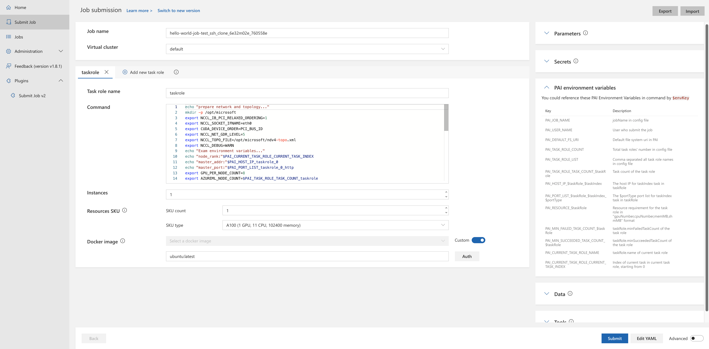
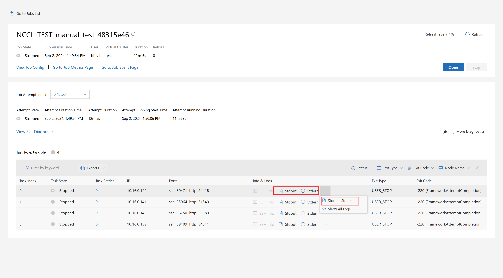

# Quick Start

## Submit a Hello World Job

A job in the Lucia Training Platform defines how to execute code(s) and command(s) in specified environment(s). It can be run on a single node or in a distributed manner.

**Step 0**. To access the Lucia Training Platform, your Microsoft account must be added to a UserGroup associated with the VC (Virtual Cluster) based on your requirements. If you know the specific UserGroup, contact the UserGroup Admin directly. If you are unsure, consult with your manager or program manager. They will guide you to the correct UserGroup Admin responsible for specific VC.

Proceed with the following steps only after you have been successfully added to a Lucia Training Platform UserGroup.

**Step 1**. Login to Lucia Training Platform (you can get the link from your UserGroup Admin).

**Step 2**. Click `Submit Job` on the left pane, then click `Single Job` to reach the Job submission page.

**Step 3**. Click the `Edit YAML` button at the bottom-right of the page, and paste the contents of [hello-world-job.yaml](https://microsoftapc.sharepoint.com/:u:/t/LuciaTrainingPlatform/ETgawzdHDz5MhWKbFwEafsABMKYwWBKcO9Gwb9xsGgBrZA?e=XcNctq).

**Step 4**. Select your VC (Virtual Cluster), and set the job name.

**Step 5**. Define the `task role name`, `commands` to run, and `resouce SKU` requirements. They will be automatically updated in the config file.
- `task role name`: What is a taskrole? For single server jobs, there should be only one task role. For some distributed jobs, there may be multiple task roles. For example, when TensorFlow is used to run distributed jobs, it has two roles: the parameter server and the worker.
**Note: The task role name will be used in the platform environment variables shown in the right-hand box, which can be referenced inside `commands`.**
- `commands`: the commands will be run on each node parallelly, it can be written like a bash script.
**Note: Please DO NOT use # for comments or \ for line continuation in the command box, as these symbols may break the syntax.**
- `Instances`: Total node count in the current task role.
- `SKU count`: The number of GPUs per node in the current task role. When `Instance` = 1: the SKU count can range from 1 to the maximum number of GPUs in a single node. When `Instance` > 1: it should always be set to the maximum number of GPUs in a single node.

**Step 6.**. Click the `submit` button to submit the job.

**Here is a demo video for the job submission: [helloworld.gif](https://microsoftapc.sharepoint.com/:i:/t/LuciaTrainingPlatform/EZPy9TQ_rx9EhqcRW79VuhkBA5T7v8wwSTLXnL4L73vZLw?e=FXMWQ3)**

## Browse Stdout, Stderr, Full logs

Click the `Stdout` and `Stderr` buttons on the job detail page to view the stdout and stderr logs for a job. To view a merged log, click `...` on the right and select `Stdout + Stderr`.

## Debug and SSH into a Running Job

By default, SSH access to a running job is not allowed. If you have special requirements, please contact the Lucia Training Platform Admin via [**Lucia Training Platform** Team Group - **User Feedback** Channel](https://teams.microsoft.com/l/channel/19%3AlrUjYbE4bhxd5hG34dJkRXEdSJF02WrcpEXayX58OdQ1%40thread.tacv2/User%20Feedback?groupId=656a4831-e31d-41fd-9ce0-6384a5156c74). If you are not a member of this channel, please refer to [Platform Issue Handling](https://eng.ms/docs/cloud-ai-platform/azure-core/azure-specialized/hpcai/azure-hpc/lucia-platform-team-documentation/luciatrainingplatform/usermanual/troubleshooting) for how to join.
